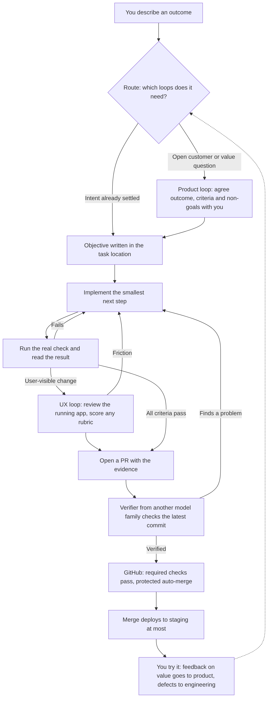
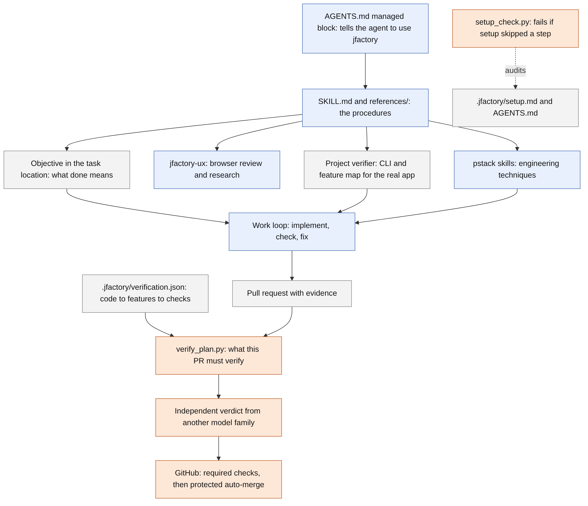
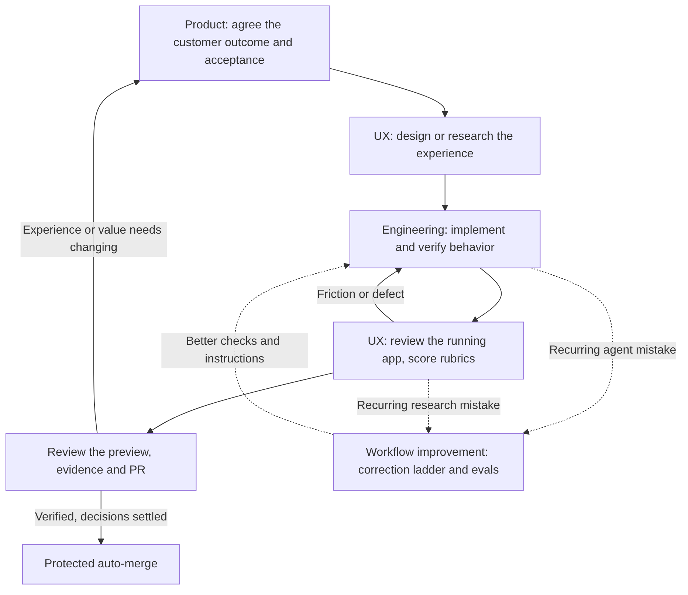
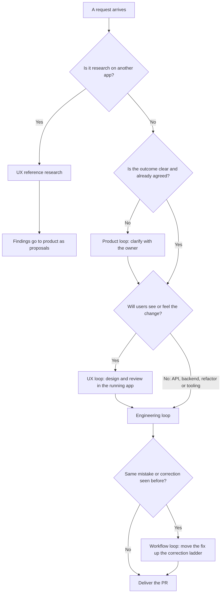
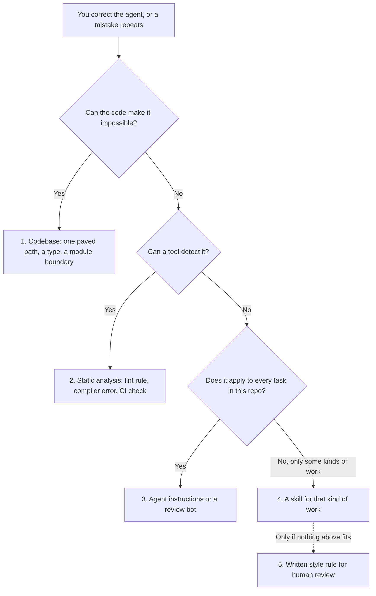
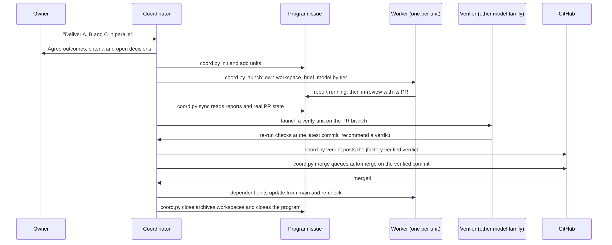

# jfactory

jfactory is a set of instructions and small tools that you install into a software project so your coding agent (Claude Code, Codex, Cursor and others) works the same careful way every time. You describe an outcome. The agent agrees what "done" means with you, builds it, proves it works on the real product, gets a second AI model to check that proof when the change is risky, and opens a pull request that merges itself only when everything required has passed.

You stay in charge of three things: what gets built, product decisions the agent can't settle alone, and releasing to production.

- [jfactory in two minutes](#jfactory-in-two-minutes)
- [What you get](#what-you-get)
- [How it fits together](#how-it-fits-together)
- [The four loops](#the-four-loops)
- [Quick start](#quick-start)
- [How one change flows through jfactory](#how-one-change-flows-through-jfactory)
- [Where objectives live and what triggers them](#where-objectives-live-and-what-triggers-them)
- [How verification works](#how-verification-works)
- [How auto-merge stays safe](#how-auto-merge-stays-safe)
- [How the agent gets better over time](#how-the-agent-gets-better-over-time)
- [Everyday prompts](#everyday-prompts)
- [Several features in parallel](#several-features-in-parallel)
- [Which AI model does what](#which-ai-model-does-what)
- [What jfactory adds to your project](#what-jfactory-adds-to-your-project)
- [Limits](#limits)
- [Relationship to Lauren Tan's pstack](#relationship-to-lauren-tans-pstack)

## jfactory in two minutes

**🔒 Enforced** means a script or GitHub check blocks the step if it's skipped. **📋 Instructed** means the agent is told to do it, and nothing mechanical stops it from skipping.

**Once per repository.** You say *"Setup jfactory from https://github.com/jordymarshall/jfactory in this project"*.

1. **Install.** The installer copies jfactory into the project and adds a pointer in `AGENTS.md`, so the agent uses it for all engineering work. It never overwrites your text. 🔒 Enforced (`install.py` refuses conflicts)
2. **Interview.** The agent asks you who the product is for, what hurts today, what success looks like, what's out of scope and what to build first. It offers a recommended answer for each, and records your answers in `.jfactory/setup.md`. 🔒 Enforced (`setup_check.py` won't report setup complete until you've answered)
3. **Build the safety net.**
   - a **verifier** that drives your real app;
   - a **map** from code areas to their checks, built step by step with the [guided mapping procedure](skills/jfactory/references/mapping.md). Each area is marked high-risk or low-risk. A PR runs only the checks for what it changed: a text fix doesn't trigger a 45-minute browser run, and a shared-code change runs exactly the browser journeys that execute it, as recorded by nightly coverage. The checks are split across parallel CI jobs;
   - a **start-up test** proving the app starts, answers and signs in from a fresh workspace, so verifiers don't fail on a missing secret or login;
   - a **CI job** that runs only the planned suites on PRs and every suite nightly;
   - the **`jfactory verified`** GitHub check;
   - a record of **what merging deploys** (staging or nothing);
   - when merges go to staging, a **release procedure**: how to see which commit each environment runs, how to promote to production, who approves and how to roll back.

   🔒 `setup_check.py --remote` won't report setup complete while the map, the check workflow, the deploy record or (for staging) the release procedure is missing, or while GitHub doesn't require the checks. It also fails on files the map doesn't cover, on browser journeys set to run on every PR, and, once verification is marked ready, when the app has no passing start-up test. It warns about unset risk levels, which default to the strictest verification, and untimed suites. The CI job keeps the map current: a PR that adds an area without mapping it fails. 📋 Building the verifier itself is an instruction.

**Every request after that,** for example *"Let users save items and find them later"*:

4. **Objective.** The agent writes what "done" means as observable criteria, each with the evidence that proves it. It also chooses which loops the work needs (product, UX, engineering) and asks you only about undecided choices. 📋 Instructed. 🔒 For any change that isn't static, the PR can't pass `jfactory verified` unless the PR description starts with it: the first non-empty line must be a heading that starts with the word Objective (any level, such as `## Objective`) or an `Objective:` line (bold allowed), followed by the objective or a link to its issue. The check confirms it's there and not trivially short. Whether it's a good objective is up to the agent and the verifier. The check re-runs when you edit the PR description.
5. **Loop.** It implements, runs the real check, reads the result and fixes, until every criterion passes. It never weakens a criterion to finish. 📋 Instructed
6. **PR and plan.** It opens a PR. `verify_plan.py` reads the changed files and decides:
   - **docs only:** static checks;
   - **low-risk areas:** CI only;
   - **high-risk areas** (anything users see, data, auth, money, security, agent instructions): a second opinion;
   - **files the map doesn't cover:** CI fails until the PR maps them, so nothing falls back to checking every feature.

   Each PR runs only the suites and journeys of the areas it touched. 🔒 `verify_plan.py ci` runs exactly the planned suites.

   🔒 Enforced
7. **Second opinion.** For high-risk changes, a model from a *different family* re-runs the checks on the PR's latest commit and posts a verdict. 🔒 `verify_plan.py` and the `jfactory verified` check refuse a verdict for a stale commit, from the same model family, or missing a high-risk feature, and every new commit resets it. 📋 That the verifier really re-ran the checks is an instruction: the verdict's evidence is a written description the tools don't validate.
8. **Auto-merge.** GitHub merges once the required checks pass. Merging deploys to staging at most; production is only ever your call. 🔒 GitHub enforces the checks once your ruleset requires CI and `jfactory verified` (setup checks this). The staging-only rule is 🔒 enforced by `coord.py merge`, and `setup_check.py` refuses to mark delivery verified when merging releases production. For a single agent's own PR it's 📋 an instruction.
9. **Handoff.** You get what changed, the actual checks and results, what's unproven, and the PR link. You try it; your feedback starts the next loop. 📋 Instructed

**When you say "release":**

10. **Release.** The agent follows the recorded procedure: it confirms which commit staging runs and lists the PRs since production, rechecks that commit on staging, names anything a rollback can't undo, promotes that same commit, and checks production read-only. If the check fails and nothing irreversible shipped, it rolls back. 📋 Instructed. 🔒 Your approval is enforced when production sits behind a protected environment, such as the [release workflow template](skills/jfactory/templates/release-production.yml) with required reviewers.

**Always on:**

11. **Learning.** When you correct the agent twice, it moves the fix to the strongest place it fits: code that makes the mistake impossible, then a lint or CI check, then instructions or a skill. 📋 Instructed
12. **Parallel work.** Say *"deliver A, B and C in parallel"*. One coordinator agent runs one isolated workspace per feature, with a GitHub issue as the dashboard. 🔒 `coord.py` refuses unsafe launches and merges, and launches nothing while the issue has the `jfactory-hold` label. 📋 Merging overlapping PRs one at a time is an instruction.



The sections below explain each step in depth.

## What you get

- **No more "keep going".** Give the agent a bounded outcome and it works through implementation, testing and fixing on its own, stopping only for decisions that genuinely need you.
- **Proof, not claims.** Every result says what was checked, how, on which commit, and what is still unproven. "It works" without evidence doesn't count as done.
- **Checks sized to the change.** A PR runs the checks for what it touched, including every browser journey that executes changed shared code, split across parallel jobs. The full browser suite runs nightly and records what each journey executes.
- **A second opinion from a different AI.** A verifier from a different model family (for example GPT checking Claude's work) re-checks each high-risk change before it can merge. Low-risk changes need only passing CI.
- **Safe automatic merging.** Verified PRs merge themselves through GitHub's protected auto-merge. Missing proof keeps the PR open. Merging deploys to staging at most; production only when you ask.
- **A record you can trust.** jfactory keeps five things apart: what you decided, what the agent assumed, what exists, what was verified, and what you accepted.

## How it fits together

jfactory has two kinds of parts, and anything important gets both:

- **Instructions the agent reads.** They tell it how to work: agree what "done" means, prove it properly, open a PR. They are guidance. An agent can still miss or misread them.
- **Checks that enforce the rules.** Scripts and GitHub settings that refuse to proceed unless the rules were actually followed. They work whether or not the agent cooperates.

For example, the instructions say "get a model from another family to verify your work". The scripts refuse a verdict for an old commit or from the same family. When the repository's ruleset requires the `jfactory verified` check (setup asks you to turn this on), GitHub refuses to merge a high-risk change until a valid verdict exists.



Blue boxes are instructions the agent follows, grey boxes are records in your project, and orange boxes are checks that enforce.

| Component | What it does | Kind |
| --- | --- | --- |
| `SKILL.md` and `references/` | The procedures: setup, objectives, verification, delivery, auto-merge, coordination | Instructions |
| pstack skills | Lauren Tan's engineering techniques, which jfactory calls for specific situations ([table below](#relationship-to-lauren-tans-pstack)) | Instructions |
| `jfactory-ux` skill | Drives a real browser to review your product or research other apps | Instructions and a helper script |
| `AGENTS.md` sections | The short entry point: product brief, system map, feature/status map, agent instructions | Record |
| `.jfactory/setup.md` | Readiness per area, the owner interview answers, open decisions and where objectives live | Record |
| Objectives | What "done" means for each piece of work, with the evidence each criterion needs | Record |
| Project verifier | A CLI that drives your real app, plus a feature map of how users reach each feature | Tool |
| `.jfactory/verification.json` | Maps code paths to features, their checks and CI suites | Record |
| `setup_check.py` | Fails if setup skipped a step or the setup record claims more than the evidence shows | Enforcement |
| `verify_plan.py` | Works out what a PR must verify and gates the verdict | Enforcement |
| GitHub required checks | Once your ruleset requires them, block the merge until CI and `jfactory verified` pass on the latest commit; setup checks they are required | Enforcement |
| `coord.py` | Runs parallel work and refuses unsafe launches and merges | Enforcement |

## The four loops

Work moves through four connected feedback loops. They are not ceremonies. The agent picks the loops each request needs, records that choice in the objective, and changes it when the work shows it's needed.



| Loop | The question it answers | What it produces | Where it lives |
| --- | --- | --- | --- |
| Product | Who is this for, what problem are we solving, what would success look like? | An agreed objective: your decisions, the agent's assumptions, acceptance criteria and non-goals | The setup interview; a product review in each substantial objective |
| UX (design) | Can someone understand and complete the task in the running product? What can we learn from other apps? | Review findings and `judgment` scores for your app; research findings as proposals | The `jfactory-ux` skill |
| Engineering | Does the implementation behave correctly, including saved data and side effects? | A PR whose criteria pass at the required evidence scopes | The objective, the implement-check-fix loop, verification |
| Workflow improvement | Where did the agent's method fail, and what stops it happening again? | A new check, rule or skill, tested with evals | The correction ladder and evals |

### How a request is routed



| Request | Product | UX | Engineering |
| --- | --- | --- | --- |
| Vague or new idea ("make saving better") | First: clarify customer, problem, outcome | After product | After UX |
| New user-facing feature | Full review | Design, then review in the running app | Yes |
| UI, copy or interaction change with settled intent | Skip | Review in the running app, often with a `judgment` rubric | Yes |
| Bug where the intended behavior is agreed | Skip | Only if users see the fix | Reproduce, then fix |
| API, CLI, data or backend change | Only if it changes what users can do | Skip; the real interface is tested instead | Yes |
| Refactor, tech debt, tooling | Skip | Skip | Yes, proving behavior is unchanged |
| "Study app X" | Receives findings as proposals | Reference research | Only after you agree a proposal |

The same correction a second time also triggers the workflow loop, whatever the request.

The route isn't fixed. These signals change it:

- **Back to product:** an undecided customer choice, a UX review suggesting the outcome won't solve the problem, or scope growing past the objective. The agent asks you, with a recommendation, and keeps doing independent work meanwhile.
- **Into UX:** a change to something users see, or a `judgment` criterion.
- **Back to engineering:** a UX review finds friction, or the verifier fails the PR.
- **Into workflow improvement:** you correct the same thing twice, or the verifier keeps catching the same mistake.

**Inside the product loop,** the agent first reads what's already settled (the brief, the setup interview, earlier objectives, the code) so it doesn't re-ask. It then asks only the open questions, each with a recommended answer and its trade-off, and records the result in the objective. Work that depends on an answer waits; everything else continues.

**Inside the UX loop,** an *experience review* drives the changed journey in your running app at the agreed screen sizes. It covers empty, loading, error and success states, keyboard and focus, and motion, and scores any rubric. Friction goes back to engineering until the journey passes. *Reference research* studies another app systematically and returns observations, inferences and recommendations kept apart. The recommendations are proposals for you, never automatic requirements.

Full detail: [routing and the loops](skills/jfactory/references/methodology.md#route-each-request-through-the-right-loops).

## Quick start

Open your project in your coding agent and say:

> Setup jfactory from https://github.com/jordymarshall/jfactory in this project.

That one prompt runs the whole adoption. You don't need to call individual skills. The agent:

1. **Installs the bundle** into your project (for example `.agents/skills/jfactory/`) and adds a short managed section to `AGENTS.md` (or `CLAUDE.md`) that points the agent at it. It never overwrites your own text.
2. **Cleans up your docs.** It merges duplicate plans and status files, fixes stale commands and conflicting instructions, and keeps unique decisions and history. `AGENTS.md` ends up with four short sections: product brief, system map, feature/status map and agent instructions.
3. **Interviews you about the product.** It reads the code first, then asks every interview question: who struggles, what they do today, what success looks like, what's out of scope, and the next objective. It asks even when it can guess, and offers its guess as the recommended answer, because code shows what exists, not what customers need. Your answers go into `.jfactory/setup.md`. Until you answer, product direction stays `blocked`.
4. **Prepares verification.** It reuses your tests, repairs setup and diagnostic commands, and creates a project verifier that can launch and drive your real app. It then writes the verification map described below. If your app needs a login, it hands you a browser to sign in yourself. Never paste passwords into chat.
5. **Sets up delivery.** It adds the `jfactory verified` GitHub check, confirms CI and branch protection, records what merging deploys, and names where objectives will live (the task location).
6. **Checks its own setup.** It runs `setup_check.py --remote`, which fails if a step was skipped or the record claims more than the evidence shows. Then it opens one adoption PR with the result.

You finish with a readiness report in `.jfactory/setup.md`. Each area (documentation, product direction, tools, verification, environments, delivery) is marked `verified`, `configured but unverified`, `blocked`, `not run by request` or `not applicable`, with the evidence or the exact step still needed from you. Installing files alone never counts as "ready".

Already set up? Just say **"Setup jfactory"** to re-check and repair drift. It updates the same record instead of creating a new one. Updating works the same way: after installing the newer version, the agent reruns the checker. Any new setup requirement shows up as a failure and is fixed in the same PR, so an updated project doesn't silently miss a new step.

## How one change flows through jfactory

Say you ask: *"Let users save a reference and find it again later."*


1. **Agree the objective.** Before building anything substantial, the agent writes down the outcome, your decisions versus its own assumptions, what's out of scope, and observable acceptance criteria. For example: *a signed-in user saves an item, still sees it after reloading and in a new session, and gets a recoverable error if saving fails.* Each criterion says what evidence proves it, such as a unit test or a run through the real app (the evidence types are listed under verification below). A missing test is work to do, not a reason to drop the criterion.
2. **Loop until it passes.** The agent picks an unmet criterion, makes the smallest change, runs the real check, reads the result and side effects, and fixes what failed. It repeats without prompting. It never weakens a criterion to finish. If it's stuck without new evidence, it changes approach or names the concrete blocker, and keeps working on anything independent.
3. **Deliver a PR.** Work happens on its own branch. The PR is ready for review (not a draft) and lists what changed, what was checked, and anything unproven, with gaps at the top.
4. **Independent verification.** If the change touches a high-risk area, another model family re-runs the required checks on that exact commit and posts a verdict. Low-risk and docs-only changes skip this step. See [How verification works](#how-verification-works).
5. **Auto-merge.** Once every required check is green on the latest commit, GitHub merges the PR. A new commit resets the verdict. See [How auto-merge stays safe](#how-auto-merge-stays-safe).
6. **Handoff.** The final message gives the outcome, what changed and how to try it, the actual checks and results, the PR link and commit, and remaining gaps. Passing tests is not the same as you accepting the result. "Saving works, but finding it takes too many steps" starts the next round.

The agent stops at the agreed objective. It proposes the next one instead of quietly expanding scope.

## Where objectives live and what triggers them

**What triggers one.** Installing jfactory adds a short managed block to `AGENTS.md` telling the agent to use jfactory for engineering work. When you ask for a change, the agent loads `SKILL.md`, which says that every request that changes behavior starts from an objective. You don't have to ask for one.

**Where it's written.** Each objective also records its route through the loops. During setup you choose the task location, for example GitHub issues labelled `jfactory-objective` or your existing tracker. It's recorded in `.jfactory/setup.md`. Each objective is written there using [the objective template](skills/jfactory/templates/objective.md) and updated as work progresses. A small fix can use a few lines in the PR description instead. A resumed session reads the objective rather than asking you to repeat yourself.

**When it asks you.** Only when a consequential choice is still open, such as who the feature is for, what trade-off to make, or what's out of scope. Each question comes with a recommended answer. Routine fixes with settled behavior go straight ahead. Before a substantial feature, the agent reviews the customer outcome with you in depth.

**What's enforced, and what isn't.**

- The PR must state its objective: for any change that isn't static, the `jfactory verified` check fails unless the description starts with a heading that starts with the word Objective (any level, such as `## Objective`) or an `Objective:` line (bold allowed) that states the objective or links its issue (the check confirms presence, not quality). Checking each criterion is an instruction: the verifier is told to check every criterion and list the results in its verdict.
- The tools enforce the mechanics around the verdict: that it's for the PR's latest commit, from a different model family, and covers every high-risk feature the PR touches. They don't read the criteria themselves.
- For parallel work, `coord.py` also refuses a worker brief without acceptance criteria, and a verdict that lacks the unit's required evidence scopes.
- If you record criteria in a machine-readable acceptance file, `evidence.py` can also check that each one has fresh, passing evidence.

## How verification works

**The right kind of evidence for each claim.** A unit test can't prove that a signed-in user's data survives a reload. jfactory names the kind of evidence each criterion needs, called its scope:

| Scope | What it can prove |
| --- | --- |
| `unit` | A function behaves correctly for given inputs |
| `component` | A real UI component works, with its outside dependencies substituted |
| `integration` | Selected real parts work together, such as the app and a throwaway database |
| `application` | The real app end to end: navigation, sign-in, the action, the resulting state and side effects |
| `provider` | The real external service (payments, email and so on) behaves as expected |
| `deployed` | The behavior on a specific deployed version and environment |
| `static` | Documentation, types, lint or build checks |
| `judgment` | A reviewer from another model family scored the result against a rubric you agreed before building |

These aren't a ladder: passing one doesn't imply another. A success message on screen doesn't prove the data was saved.

**Fuzzy criteria are allowed.** Some things no test can decide, such as "a first-time user finds the save control quickly" or "the error explains how to recover". For these, the objective includes a rubric written before building: observable points, what the judge inspects (screenshots, a walkthrough video, the running preview) and a pass mark. The independent verifier scores it at the PR's latest commit and names what it looked at. A passing judgment counts toward `jfactory verified` and auto-merge like any other check. When criteria live in an acceptance file, `evidence.py judge` records the score, and it refuses a judge from the implementer's model family. The handoff labels it as an assessment, and it never replaces a real test where one is possible or your own acceptance.

**The project verifier.** Setup gives your project its own verification skill with two parts. The first is a small CLI that launches and drives your real app and captures proof, so every session runs the same commands instead of writing new scripts. The second is a feature map: what each feature is, and how a user reaches it (navigation, keyboard shortcuts, selectors). Together they let the agent check its own work and reproduce vague bug reports.

**Checks come from what changed.** `.jfactory/verification.json` maps file paths to features, each with a verification recipe and the CI suites it needs:

```json
{
  "static": ["docs/**", "LICENSE"],
  "features": {
    "save-item": {
      "paths": ["app/src/items/**"],
      "recipe": ".agents/skills/verify-app/features/save-item.md",
      "suites": ["unit", "browser"]
    }
  }
}
```

Running `verify_plan.py plan` on a PR decides what it needs:

| The PR changes | What's required |
| --- | --- |
| Only files marked static (such as `docs/**`) | Static checks only; no independent verifier |
| Only low-risk features (`"verify": "ci"`) | Their CI suites; no independent verifier |
| Any high-risk feature (`"verify": "independent"`, the default) | Its recipe and CI suites, plus a verdict from another model family |
| Any file the map doesn't cover, or the gate itself (`.jfactory/`, `.github/workflows/`, `.github/rulesets/`) | Everything: full verification of every feature |

**Verification by risk.** Each feature area in the map has a risk level, which you confirm at setup.

- **High-risk areas get a second-model check:** anything users see (product and UX), stored data, sign-in and permissions, payments, migrations, security, agent instructions, and the scripts that enforce the rules.
- **Low-risk areas need only passing CI:** internal refactors covered by tests, test helpers, and small internal tools.
- **Mixed changes take the stricter level.**
- **Nobody can quietly downgrade an area.** The level is read from the main branch, so a PR can't lower its own. Changing the map itself always needs full verification.
- **When unsure, the level is high-risk.**

Unknown files fall back to full verification, so a gap in the map is always safe. Agent instructions, skills and recipes are never static, even though they're Markdown, because they change how the agent behaves.

**The independent verdict.** A verifier from another model family checks out the PR at its latest commit, runs the plan's recipes against a preview or staging, reviews the diff and posts a verdict comment with `verify_plan.py verdict`. The tool refuses:

- a verdict for an older commit;
- one that skips a required feature;
- one from the same model family as the implementer, unless you've recorded `"allow_same_family": true` as a deliberate decision.

**The `jfactory verified` check.** A GitHub workflow (`.github/workflows/jfactory-verified.yml`) re-evaluates on every push and comment and sets a commit status. It passes on its own for static and low-risk changes. Otherwise it passes only for a verdict at the current commit that covers the plan's high-risk features, posted by a repository owner, member or collaborator. It runs from your base branch and never executes code from the PR, so a PR can't edit its own gate. Any new push resets it.

The tools enforce coverage and freshness. They can't judge whether a test really proves the behavior, so the verifier and reviewers still read the evidence.

## How auto-merge stays safe

jfactory's default policy, which you can change:

- **Verified work merges itself.** Once every acceptance criterion passes at its required scope on the PR's latest commit, the agent queues GitHub's protected squash auto-merge, pinned to that commit. It doesn't ask again each time.
- **Merging deploys at most to staging.** If merging your main branch releases to production today, auto-merge stays off until that's changed with your authorization.
- **Production is always your call.** Green CI, a verified verdict or a merged PR is never a request to release. When you ask, the agent follows the release procedure setup recorded. See [production releases](skills/jfactory/references/release.md) for the host patterns (Vercel promotion, GitHub environments, tags) and the steps.

This relies on real GitHub settings, not just instructions:

1. **Allow auto-merge** is enabled in the repository settings.
2. A ruleset or branch protection on main requires PRs and both required checks: your CI job and `jfactory verified`.
3. Nobody can bypass the ruleset, and the agent never uses `--admin` or pushes to main directly.

If settings access is missing, the agent leaves the PR open and tells you the exact setting to change. It never substitutes an unconditional merge. If new work invalidates evidence after auto-merge is queued, it cancels the queue, re-verifies and re-queues.

## How the agent gets better over time

**Earn autonomy with evidence.** Trust in an agent comes from watching it work. For a new kind of task, watch what the agent actually does, correct it, and turn the correction into a check or skill. Once it does that task correctly without help, let it run unattended, then several at once. Protected auto-merge can be on from the start, because it only ever lands verified work to staging at most.

**The correction ladder.** Whenever you correct the agent, or it makes the same mistake twice, fix the problem at the strongest level that fits, not just in the current change. The strongest levels enforce themselves; the weakest rely on someone remembering.



| Level | Examples | Enforced by |
| --- | --- | --- |
| 1. Codebase | One obvious way to do each thing, types or module boundaries that make the mistake impossible | The code the agent copies |
| 2. Static analysis | Lint rules, compiler errors, CI checks | A failing check |
| 3. Agent instructions and review bots | `AGENTS.md`, automated PR review | The agent reading them |
| 4. Skills | Workflow or verification skills | The agent loading them |
| 5. Style guide | Written conventions | A human reviewer noticing |

Agents copy the patterns they see, so a workaround left in the code, or a comment that turns one reviewer's remark into a "rule", spreads. Keep the codebase in a state you'd be happy to see copied. Feedback on one PR applies to that PR unless you say it's a standing rule.

This is how the workflow-improvement loop runs in practice. It lives in `SKILL.md` ("Improve the workflow from failures") and in [the methodology](skills/jfactory/references/methodology.md#the-correction-ladder). It is itself an instruction: nothing checks that the agent climbed the ladder. When it does, though, the result is a real check that keeps working. jfactory's own setup checker came from this: setup once skipped the owner interview, so that step is now checked.

Changes to jfactory's own instructions should be tested the same way Lauren Tan tests pstack: blinded trials on realistic tasks across several AI models, judged by a different model family. The cases are in [evals/scenarios.md](evals/scenarios.md). These trials haven't been run yet; see [Limits](#limits).

## Everyday prompts

| You want to | Say |
| --- | --- |
| Build something | *"Let users save a reference and find it again when they return later."* |
| Research another app's UX | *"Study [app URL] to understand how people organize and find saved items, including the interactions and animations. Show me what we can learn for our product."* |
| Check verification is current | *"Audit our verification skill and feature map against the current app. Repair stale instructions and show which journeys were actually exercised."* |
| Update jfactory | *"Update jfactory from https://github.com/jordymarshall/jfactory and reconcile this project's setup. Preserve our product decisions and existing work."* |
| Re-check the setup | *"Setup jfactory"* |

For app research, the agent drives a real browser, records video and screenshots, and returns a walkthrough that separates what it observed, what it infers, and what it recommends. Another app's choices are ideas to discuss, not requirements. If the app needs a login, you sign in through a browser it hands you (a local window, or an authenticated preview link in Conductor cloud) and then hand control back.

Updates happen only when you ask. Normal feature work uses the installed version, and there's no background updater.

## Several features in parallel

In [Conductor](https://www.conductor.build), ask one agent to coordinate:

> Use jfactory to deliver [feature A], [feature B] and [feature C] in parallel. Clarify each outcome and its acceptance criteria with me first, then run at most three workspaces at a time.

### Who does what

| Role | Who | Does | Never does |
| --- | --- | --- | --- |
| Owner | You | Agrees outcomes and answers decisions; can pause everything | Needs to babysit workers |
| Coordinator | The agent you asked | Plans units, writes briefs, launches and monitors workers, launches verifiers, records verdicts, merges | Edits a worker's code, or merges a high-risk change without a verified verdict |
| Worker | One agent per unit, in its own Conductor workspace | Runs the normal jfactory loop for its unit and opens one PR | Touches other units' branches, merges or launches workers |
| Verifier | One per PR that touches a high-risk area, from a different model family | Re-runs the checks and reviews the PR at its latest commit, then recommends a verdict | Changes product code |

### How a program runs



1. **Frame it with you.** The coordinator agrees each unit's outcome, acceptance criteria, required evidence, dependencies and the files it owns. Product questions are settled now, because a running worker can't stop to interview you; any left open are recorded as decisions that block that unit. If one session could do the work, it says so and doesn't start parallel workspaces.
2. **Settle uncertainty before splitting.** An open design question gets a throwaway prototype first. A shared API or schema lands as its own first unit, and dependents wait for it or stack on it.
3. **One dashboard.** `coord.py init` opens a GitHub program issue listing every unit's state, model, PR, verdict and open decisions. Only the coordinator edits it; workers post report comments.
4. **A complete brief per unit.** The brief is the worker's whole context: objective, decisions, scope, context, acceptance, verification steps, shared resources, limits, forbidden actions, delivery and reporting. `coord.py` refuses a brief with a missing field.
5. **Launch in isolation.** Each unit gets its own Conductor workspace, branch and PR. The model comes from the unit's role and your remaining usage (see the next section). A new kind of unit is piloted alone first. Free slots are refilled as units finish, up to the concurrency limit (default three).
6. **Monitor by evidence.** The coordinator runs `coord.py sync` at natural points. It folds in worker reports, reads the real PR state, voids verdicts when a PR gets a new commit, archives finished workspaces and lists what's ready. It doesn't ping workers to ask how they're doing, because a message restarts their turn.
7. **Verify independently.** Once a worker's PR is in review and touches a high-risk area, a verify unit from the other model family checks out that PR and re-runs its checks. It recommends a verdict. The coordinator inspects the evidence and records it with `coord.py verdict`, which also posts the `jfactory verified` verdict.
8. **Merge one at a time.** `coord.py merge` queues protected auto-merge pinned to the PR's current commit: after a verified verdict at that commit, or on GitHub's required CI alone when every change is low-risk. Overlapping units merge one at a time, and dependent workers update from main and re-check after each merge.
9. **Close.** Once every unit is merged, done or abandoned, `coord.py close` closes the issue, archives the program's workspaces and removes its sidebar section.

### Guards `coord.py` enforces

| Refuses to | Unless |
| --- | --- |
| Launch | Under the concurrency limit, no hold label, dependencies merged (or stacked deliberately), no open decision for the unit, a complete brief, an available model, and fewer than 3 previous attempts |
| Launch a verifier | It's from a different model family than the unit's implementer |
| Record a verified verdict | It's for the PR's current commit, covers the unit's required evidence scopes, and comes from another family |
| Merge | A verified verdict exists at the current commit (or every change is low-risk `verify: ci`, leaving GitHub's CI as the gate), no decision is open, and merging deploys to staging or nothing |
| Close | Every unit is merged, done or abandoned |

### Your controls and recovery

- **Decisions:** answer in the coordinator's chat or on the issue.
- **Direct feedback:** open any worker's workspace and message it. It applies the feedback within its unit and reports it, so the coordinator can pass it on.
- **Pause everything:** add the `jfactory-hold` label to the issue. New launches stop, and each worker is told at its next report to stop safely and push. Remove the label to resume.
- **A stalled worker:** relaunched once with a narrower brief or another model. After three attempts the unit is abandoned and replanned.
- **A worker that hit a usage limit** hasn't failed. It continues on the fallback model without using up an attempt.
- **If the coordinator's session ends:** a new one runs `coord.py list` and `sync`, and resumes from the issue without relaunching finished units.

Nothing runs in the background. Coordination happens only while an agent is using it, and parallel workspaces multiply cost, so jfactory starts them only when you ask. Full procedure: [coordination](skills/jfactory/references/coordination.md).

## Which AI model does what

When jfactory launches another agent, the task decides the tier, and remaining usage decides between that tier's first choice and its fallback. It never moves core coding to a weaker tier to save usage.

| Tier (coordination role) | Used for | First choice | When that account is out of usage |
| --- | --- | --- | --- |
| Frontier (`implement`) | Features, fixes, debugging, architecture | Claude Opus 5.5, medium effort | GPT Astra 6 |
| Fast (`fast`) | Routine edits, fixes with a known cause, CI triage | GPT Sol 6 | Opus 5.5, low effort |
| Trivial (`trivial`) | Renames, formatting, lookups | GPT Luna 6 | Opus 5.5, low effort |
| Verify (`verify`) | Checking another agent's PR | GPT Luna 6, fast mode | Opus 5.5, low effort |

A verifier always comes from a different family than the implementer, so Codex-written work is verified by Opus 5.5 at low effort. Before launching, agents run `scripts/usage.py`. It reads your Claude and Codex usage from Conductor session records and Codex logs, starts a tiny probe session if a reading is missing or stale, and prints the model to use. It never reads credential files. Override the policy per repository in `.jfactory/coordination.json`. See [model selection](skills/jfactory/references/models.md).

## What jfactory adds to your project

| Path | What it is |
| --- | --- |
| `.agents/skills/jfactory/` (or `.claude/…`, `.cursor/…`) | The installed bundle: instructions, procedures, tools and the pinned pstack skills. Don't edit it; the installer refuses to update over local edits. |
| Managed block in `AGENTS.md` or `CLAUDE.md` | A short pointer telling the agent to use jfactory. Your surrounding text is preserved. |
| `.jfactory/setup.md` | The setup record: readiness per area, owner interview answers, open decisions and the task location. |
| `.jfactory/verification.json` | The verification map: paths to features, recipes and CI suites. |
| `.jfactory/coordination.json` | What merging deploys (`staging`, `none` or `production`), the release procedure and any model-policy overrides. |
| `.github/workflows/jfactory-verified.yml` | The workflow behind the `jfactory verified` check. |
| Your project verifier skill | The CLI and feature map for driving your app. It lives outside the jfactory bundle because it's yours. |
| `.context/jfactory/`, `.context/ux/` | Local evidence and browser studies. Keep them out of Git; they can contain private data. |

The tools inside the bundle:

| Tool | Purpose |
| --- | --- |
| `setup_check.py` | Checks that setup is complete and that the setup record's claims match the evidence; `--remote` also checks the GitHub gates |
| `verify_plan.py` | Works out what a PR must verify, posts verdicts and computes the `jfactory verified` status |
| `coord.py` | Runs parallel programs: issue dashboard, launches, reports, verdicts, merges and clean-up |
| `usage.py` | Reads remaining Claude and Codex usage and picks the model for each tier |
| `evidence.py` | Optionally records real check runs and rejects failed, stale or wrong-scope evidence |
| `check-upstream.py` | Confirms the vendored pstack files match their pinned upstream bytes |
| `jfactory-ux/scripts/study.py` | Drives an isolated browser for UX research and sign-in handoff, and renders walkthroughs |
| `templates/` | The setup record, objective, verification map example and `jfactory verified` workflow |

## Limits

- **Instructions guide; they don't guarantee.** An installed skill doesn't prove an agent will follow it. The hard guarantees come from GitHub's required checks and branch protection, which setup configures only with your permission.
- **Tools check coverage and freshness, not meaning.** They confirm the right checks ran on the right commit. They can't tell whether a test really proves the behavior.
- **Each project proves its own journeys.** A component test can't prove a signed-in, end-to-end journey; only application evidence can.
- **Behavioral trials are still pending.** jfactory's scripts have automated tests, and the browser helpers are tested against local pages. Full adoption and cross-model behavior trials of the instructions haven't been run yet. The planned cases are in [evals/scenarios.md](evals/scenarios.md).
- **No background automation.** Nothing runs between agent sessions: no scheduler, no updater, no supervisor.
- **Platform support.** The tools need Python 3.10+ and are tested on Linux. macOS host integration hasn't been demonstrated by the automated tests. On Windows, use WSL. Browser features also need Node/npm and Chrome.

## Relationship to Lauren Tan's pstack

jfactory is built around selected skills from Lauren Tan's [pstack](https://github.com/cursor/plugins/tree/ecc249f1e306fc64ddf83c7bed16cacf7c2239db/pstack). They're vendored unchanged in `skills/jfactory/vendor/pstack/` and pinned to one upstream commit; `check-upstream.py` confirms the bytes still match.

The agent doesn't load them on its own. jfactory's [routing table](skills/jfactory/references/pstack.md) tells it which one to read for each situation, and jfactory's rules (repository permissions, the objective, PR delivery) take precedence over anything in them:

| Situation | pstack skill |
| --- | --- |
| Build or repair the project verifier and feature map | `create-verification-skill`, `maintain-verification-skill` |
| Check completed work against the real thing | `principle-prove-it-works` |
| Understand how code works, or why it was built that way | `how`, `why`, `teach` |
| Fix a bug that has a cheap reproduction | `tdd` |
| Review a change adversarially | `interrogate` |
| Settle a design question before building | `prototype`, `architect` |
| Split large work into ordered PRs | multi-PR plan, `principle-sequence-verifiable-units` |
| Run several objectives in parallel | `orchestrate`, adapted into jfactory's `coord.py` |
| Drive one objective to done without stopping | autonomous run |
| Resume or pause another session's work | session pickup, pause safely |
| Test a change to instructions or skills | the eval playbook, `arena` |

In short, pstack supplies the engineering techniques. jfactory adds:

- product alignment with the owner;
- UX research;
- documentation clean-up;
- change-aware verification with an independent verdict;
- staging-only auto-merge;
- portable setup that's checked.

From her September 2026 talks it also takes earning autonomy step by step, and the correction ladder. See [the methodology and its evidence limits](skills/jfactory/references/methodology.md).

<details>
<summary>Manual installation and updates</summary>

Inspect a checkout, then install with Python 3.10+:

```sh
git clone https://github.com/jordymarshall/jfactory.git /tmp/jfactory
python3 /tmp/jfactory/scripts/install.py /path/to/project
```

Where the installer puts things:

- **Default:** the bundle goes in `.agents/skills/jfactory` and a managed section is added to `AGENTS.md`.
- `--agent claude` uses `.claude/skills/jfactory` and `CLAUDE.md`.
- `--agent cursor` uses `.cursor/skills/jfactory` and `AGENTS.md`.
- Other agents can read [SKILL.md](skills/jfactory/SKILL.md) directly.

Check that your agent actually discovers the instructions. Installation writes a receipt, `.jfactory-install.json`, recording the source commit. It doesn't install dependencies, sign into apps, commit, push or deploy. After installing, ask the agent to "Setup jfactory" to complete adoption.

To update, inspect the newer checkout and rerun the installer with `--update`. It refuses to overwrite locally modified bundle files or an edited managed block. Move project-specific behavior into your own instructions or verifier skill first.

The installer also migrates an unmodified legacy `jstack` installation to `jfactory`, including its instruction block and receipt. It refuses ambiguous dual installations. After migrating:

- update any project-owned references to the old skill paths, then reload the agent session;
- leave historical evidence under `.context/jstack/` untouched, and run fresh checks into `.context/jfactory/`;
- close any study browsers opened with the old helper before upgrading.

</details>

<details>
<summary>Developing jfactory</summary>

```sh
python3 -m unittest discover -s tests -v
python3 skills/jfactory/scripts/check-upstream.py
npx --yes @playwright/cli@0.1.21 install-browser ffmpeg
python3 tests/browser_smoke.py
python3 tests/dashboard_smoke.py
python3 skills/jfactory/scripts/setup_check.py --remote   # this repository's own setup
```

The README's diagrams are images rendered from `docs/diagrams/*.mmd`, because GitHub's mobile app doesn't render Mermaid. After editing a source, run `python3 scripts/render_diagrams.py` (needs Node and Chrome) and commit the source, the image and `manifest.json`. `tests/test_links.py` fails if they drift.

This repository uses jfactory on itself. [AGENTS.md](AGENTS.md) holds its brief and agent instructions. [.jfactory/setup.md](.jfactory/setup.md) holds its current readiness and open decisions.

[The main ruleset](.github/rulesets/main.json) requires PRs, squash merges, and both the `checks` job against current `main` and the `jfactory verified` status. An administrator must import it in GitHub; committing the JSON doesn't activate it.

The tests cover:

- installation preservation;
- verification planning and verdict rules;
- coordination against simulated `gh` and `conductor`;
- evidence freshness;
- real browser actions and the sign-in dashboard handoff.

CI uses disposable local pages, not real accounts. Test changes to jfactory's instructions with realistic, isolated model trials from [the evaluation cases](evals/scenarios.md); passing unit tests is not a behavior benchmark. Update pinned dependencies in a separate change and rerun the integrity and behavior checks.

</details>

## Attribution

pstack files are unchanged: MIT, copyright Lauren Tan 2026, version 0.15.5 at `ecc249f1e306fc64ddf83c7bed16cacf7c2239db`. See [provenance](skills/jfactory/vendor/pstack/UPSTREAM.md) and [license](skills/jfactory/vendor/pstack/LICENSE). jfactory additions are MIT, copyright Jordan Marshall 2026. This is an independent adaptation. Microsoft Playwright CLI is an optional runtime dependency; its upstream skill is not vendored.
