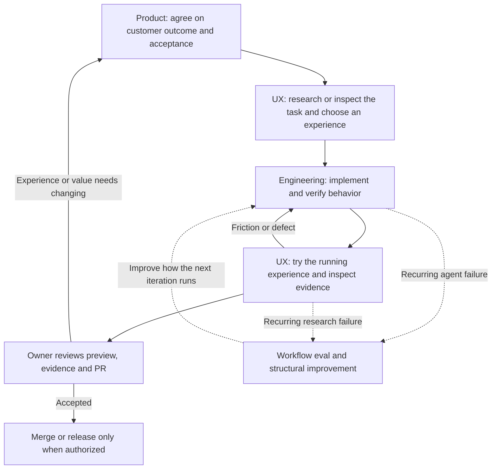

# jstack

jstack helps a coding agent work independently toward an agreed customer outcome, show what it learned and verified, and return a pull request you can review.

## The methodology

Four connected loops answer different questions. The agent chooses the loops relevant to the task and continues within the agreed scope. You set direction and review consequential decisions and the resulting experience.

| Loop | Question | Work and feedback | What it produces |
| --- | --- | --- | --- |
| **Product** | Are we solving the right problem for this customer? | Inspect existing decisions, interview unresolved customer/experience choices, agree on a bounded outcome, then review what users or the owner learn from trying it. | Customer hypothesis, experience goal, scope and observable acceptance criteria in the existing product/task documents. |
| **UX** | Can someone understand and comfortably complete the task? | Explore approved reference apps when useful, map real journeys and states, inspect our running experience, propose changes, then try it again. | Evidence-backed app maps, screenshots and motion recordings, coverage gaps, proposed interaction choices and a reviewable walkthrough. |
| **Engineering** | Does the implementation actually behave as agreed? | Implement, run a meaningful check, drive the real user path, inspect resulting state and side effects, fix discrepancies and repeat. | Working changes, component/application/provider evidence at the required scopes, and a PR. |
| **Workflow improvement** | Is the agent's way of working reliable? | Investigate recurring misses, compare skill changes on realistic isolated tasks, inspect actual tool use and artifacts, and encode mechanical rules in tests/types/CI. | A corrected tool, check or skill backed by an appropriate eval. A model's self-rating is insufficient. |

### How they work together



These are feedback loops, not four mandatory ceremonies. A settled bug may need only the engineering loop. A substantial feature needs product alignment and an experience review. An in-depth competitor study runs the UX loop and returns findings before any product implementation. Research can send an unresolved customer choice back to the product loop at any point.

The agent's inner loop can run many times while you are away. Every iteration needs new evidence. The outer product/experience checkpoint is where you try the result and decide whether it is what you want. Workflow evals are separate experiments on the agent's methods; passing an app test is not a skill eval, and a skill eval does not prove the app works.

For example, if the goal is “save an item and find it later,” the product loop establishes who needs it and why. UX research examines organization, feedback and recovery in approved apps, then recommends a flow for our customer. Engineering implements it and checks save, reload and independent readback. UX review checks whether the flow is understandable on the relevant devices, including loading, errors, focus and motion. You receive the walkthrough and PR, with unresolved choices visible.

### The record you should be able to understand

**What you decided → what the agent inferred → what exists → what was verified → what you accepted.**

Keep `AGENTS.md` as a short entry point to the product brief, system map, feature/status map and agent instructions. Detailed facts have one canonical home. The agent updates affected decisions and evidence as it works, preserves historical proof and marks stale claims. It resumes the current objective instead of generating a new roadmap each turn.

The [verification contract](skills/jstack/references/verification.md) separates unit, component, integration, application, provider and deployed claims. Component checks can cover states and interactions cheaply; an authenticated journey still needs application evidence. Optional command receipts reject failed, stale or insufficient-scope evidence, but cannot judge whether a check proves the intended outcome.

## Learning an app in depth

The bundled [jstack-ux skill](skills/jstack/skills/jstack-ux/SKILL.md) uses real browser interaction. Start with:

> Study [app URL] in depth for [customer tasks]. Use my approved dedicated account. Map navigation, objects, journeys, state transitions and motion. Show what you observed, inferred and recommend for our product. Keep a coverage map and return a visual walkthrough with gaps. Do not change shared data or implement the findings yet.

The agent first inventories the app, prioritizes journeys, then explores each with a persistent browser session. It follows controls, checks resulting states and readback, records successful paths and motion, and returns linked evidence. It carries unanswered questions into the next pass. “In depth” means systematic coverage of a stated scope, not a promise to know every hidden role, plan or backend.

The optional browser helper uses [Microsoft's Playwright CLI](https://github.com/microsoft/playwright-cli) for named sessions, screenshots, traces and video. Use a capable existing host browser tool when available. [Browser setup](skills/jstack/skills/jstack-ux/references/browser.md) covers the pinned CLI, human login, capture commands and motion observation. [Research records](skills/jstack/skills/jstack-ux/references/research.md) explain the app map and private HTML walkthrough.

For a subscribed competitor app, sign into a dedicated visible browser yourself. Cloud agents do not inherit a Mac browser login. Use a local workspace or a supported remote browser; do not paste credentials into chat. Profiles, traces and research captures stay in gitignored `.context/ux/` until reviewed for sharing. The helper organizes sessions; it does not enforce permissions on clicks or make every app automatable. Native-only apps need another driver. Customer usability still requires customer evidence.

## Use in a project

Tell your coding agent:

> Adopt the product, UX and engineering workflow from https://github.com/jordymarshall/jstack in this repository. Inspect the README and installer first, install the skill, preserve existing instructions, then follow jstack's repository setup. Establish our objective and real application verification. Deliver changes as a PR; use a draft if required evidence is blocked.

Or inspect a checkout, then install with Python 3.10+:

```sh
git clone https://github.com/jordymarshall/jstack.git /tmp/jstack
python3 /tmp/jstack/scripts/install.py /path/to/project
```

The default installer copies the self-contained bundle into `.agents/skills/jstack` and adds a small managed section to root `AGENTS.md`. It preserves surrounding text, refuses conflicting local modifications, and records payload hashes and the source commit. Repeating the same installation is safe. Updating requires a reviewed source checkout and `--update`; locally modified managed files still cause a refusal. No remote shell pipe, automatic dependency installation, credentials, commits, pushes or deployment.

`--agent claude` uses `.claude/skills/jstack` and `CLAUDE.md`; `--agent cursor` uses `.cursor/skills/jstack` and `AGENTS.md`. These installation layouts are tested; actual model behavior and those hosts' runtime integrations must be verified in your project. Other agents can read [SKILL.md](skills/jstack/SKILL.md) directly. Reload/start a fresh agent session after adoption and confirm it sees the instructions.

## Daily use

After adoption, describe the outcome in ordinary language. jstack's managed instructions route meaningful UI work into UX review and route uncertain intent into product clarification; you do not need to name every skill.

> Build [outcome] within [scope]. Clarify consequential choices, inspect the real experience, verify the agreed criteria, update the existing records and return a PR with a walkthrough. Continue routine implementation and corrections without waiting for “keep going.”

Instructions guide the agent during your session; they are not a background scheduler or a guarantee of compliance. Check that the agent can state the objective, produce real evidence and explain gaps. The default finish is a ready PR when required proof passes, or a draft when proof is blocked. Merging and deployment require separate authorization.

## What this does not promise

- Installing instructions does not guarantee an agent follows them or make an application correct.
- No application-specific tests, customer hypotheses, production credentials or business documents are bundled.
- No background daemon, automated merge, production deployment, or remote branch protection is configured.
- No universal model benchmark or cross-model reliability claim. `evals/scenarios.md` provides realistic evaluation cases; model trials must be run and inspected separately.
- Python command capture is POSIX-only; use WSL or host-native tools on Windows. Installation tests do not demonstrate macOS/Claude/Cursor runtime behavior.

## Develop and verify jstack

```sh
python3 -m unittest discover -s tests -v
python3 skills/jstack/scripts/check-upstream.py
npx --yes @playwright/cli@0.1.21 install-browser ffmpeg
python3 tests/browser_smoke.py
```

The browser smoke check is documented in `tests/browser_smoke.py` and runs in CI with Chrome. It uses a local disposable app, not a real subscribed competitor account.

Tests exercise non-destructive installation, updates, failure capture, stale evidence and component/application scope separation. CI runs these checks on PRs. Changes to the workflow itself should also use the bundled pstack eval playbook with actual tool transcripts and artifacts. A passing packaging test is not a behavioral eval.

## Attribution and updates

Built around selected [Lauren Tan pstack](https://github.com/cursor/plugins/tree/ecc249f1e306fc64ddf83c7bed16cacf7c2239db/pstack) skills. This is an independent adaptation, not an official Cursor, Microsoft or OpenAI plugin. Microsoft Playwright CLI is an optional runtime dependency and its upstream skill is not vendored.

Original pstack files: copyright Lauren Tan 2026, MIT, version 0.15.5 at `ecc249f1e306fc64ddf83c7bed16cacf7c2239db`. See [upstream provenance](skills/jstack/vendor/pstack/UPSTREAM.md) and [license](skills/jstack/vendor/pstack/LICENSE). jstack additions are MIT, copyright Jordan Marshall 2026.

Update upstream in a separate checkout, review its diff and compatibility, retain the original license, regenerate the receipt from original bytes and run integrity/behavior checks. Never silently follow upstream main or customize the vendored originals in place.
