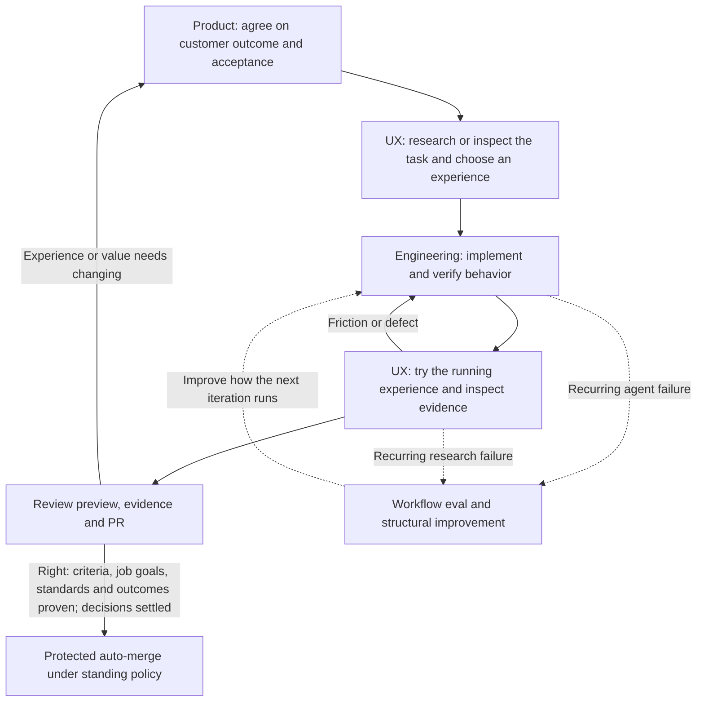

# How the loops work together

The product loop sets the destination. The UX loop studies and improves the path a customer takes. The engineering loop makes the agreed behavior work. Workflow evals improve how the agent performs that work.

**Done means right.** A change is done only when it is right: it serves the outcomes in `outcomes/README.md` and crosses none of its non-goals, keeps every standing goal of the jobs it touches (`outcomes/<job>.md`), meets the standards map (`.jfactory/standards.md`) and meets its own criteria, each proven at the current commit. Green CI, passing tests, an approved review or a completed checklist is evidence toward done, never done by itself. Done but not right is not done: keep working, or report it as not done. The loops exist to make work right; each one's evidence counts only toward that.

These are feedback loops, not four required ceremonies for every change. A settled bug may need only the engineering loop. A substantial feature needs product alignment and an experience review. A competitor study runs the UX loop and returns findings before product implementation. Research can reveal an unresolved customer choice and send it back to product alignment.

The agent's inner loop can run many times while you are away. Each iteration needs new evidence from a test, application interaction or observed state. The outer product/experience checkpoint is where you or customers try the result and decide whether it solves the intended problem.

For example, to let a user save an item and find it later:

1. Product alignment establishes the customer, context and useful outcome.
2. UX research examines organization, feedback and recovery in approved apps, then proposes a flow for our customer.
3. Engineering implements it and checks save, reload and independent readback.
4. UX review checks navigation, feedback, loading/errors, focus, motion and relevant devices in the running application.
5. The owner receives a walkthrough and PR, tries the task and accepts it or gives specific feedback. Protected auto-merge lands only work verified as right: its criteria, the standing goals of its jobs, the standards and the outcomes, each proven. Technically correct work that misses any of them is not done and does not merge. Required product decisions must be settled before it is queued; the owner's feedback afterwards refines the product, it doesn't finish unfinished work.

Workflow evals are separate experiments on the agent's methods. Passing an app test does not prove a skill makes good decisions. A skill eval does not prove an app works. Inspect actual tool use and artifacts; compare variants on equivalent isolated tasks where practical. Prefer a deterministic test, type or CI check for repeated mechanical errors.

Keep owner decisions, agent assumptions, implementation, verification and acceptance distinct in existing canonical records. A screenshot cannot prove persistence; a component fixture cannot prove an authenticated app path; an agent's UX critique cannot establish customer usability. The [verification contract](verification.md) defines evidence scopes.

## Route each request through the right loops

Choose the loops when you write the objective, and record the choice and the reason in its **Route** field. The request type sets the starting route:

| Request | Product | UX | Engineering | Workflow |
| --- | --- | --- | --- | --- |
| Vague or new idea ("make saving better") | First: clarify customer, problem and outcome | After product | After UX | If the same misunderstanding recurs |
| New user-facing feature | Full review of customer, outcome, success measure and non-goals | Design, then review in the running app; reference research only for an open design question | Yes | On recurring failures |
| UI, copy or interaction change with settled intent | Skip | Review in the running app, often with a `judgment` rubric | Yes | |
| Bug where the intended behavior is agreed | Skip | Only if users see the fix | Yes: reproduce first, then fix | If the bug came from a repeatable agent mistake |
| API, CLI, data or backend change | Only if it changes what users can do | Skip; exercise the real interface instead | Yes | |
| Refactor, tech debt, tooling | Skip; behavior must not change | Skip | Yes, with checks that behavior is unchanged | Often: it is layer 1 or 2 of the correction ladder |
| "Study app X" | Receives the findings as proposals | Reference research | None until a proposal is agreed | |
| The same correction a second time | | | Fix this instance | Yes: move the rule up the ladder |

The route can change during the work. These signals send it back:

- **Back to product:** a consequential customer choice nobody has decided; research or a UX review suggests the agreed outcome will not solve the problem; the work is growing beyond the objective. Ask the owner with a recommendation and keep working on anything that doesn't depend on the answer.
- **Into UX:** engineering changes a flow, screen or message users see, or the objective has a `judgment` criterion.
- **Back to engineering:** a UX review finds friction or a defect, or the independent verifier fails the PR.
- **Into workflow improvement:** the owner corrects the same thing twice, the verifier keeps catching the same class of mistake, or an eval fails.

### What the product loop produces

The product loop turns an intent into an agreed objective.

1. **Investigate first.** Read the brief, the setup interview, earlier objectives and the code, so you don't ask what is already settled.
2. **Ask about what's left.** Ask focused questions about what is still open: who this is for, what they do today, the outcome they would notice, how success is measured, and what is excluded. Offer a recommended answer and its trade-off with each question.
3. **Record the result** in the objective: owner decisions kept separate from agent assumptions, observable acceptance criteria, and non-goals.

Work that depends on an open answer waits for it; independent work continues. The loop ends when the owner agrees the objective, or confirms a recorded proposal. It restarts when the owner tries the result and gives feedback about value rather than defects.

### What the UX loop produces

The UX loop has two modes, both in the [UX skill](../skills/jfactory-ux/SKILL.md).

- **Experience review of your own product.**
  - Drive the changed journey in the running app at the agreed viewports, through the real interface.
  - Check empty, loading, error and success states, keyboard and focus, and motion.
  - Compare the result with the objective and fix friction in the engineering loop.
  - Score any `judgment` criterion against its rubric.
  - It ends when the journey passes with application evidence and the rubric passes. The owner then tries the preview.
- **Reference research on other apps.**
  - Map the app's journeys and cover them systematically, keeping observations, inferences and recommendations separate.
  - Findings go to the product loop as proposals. They are never requirements until the owner agrees.

A UX judgment is an assessment, not customer validation. Owner and customer feedback stays a separate check.

## Earn autonomy with evidence

Autonomy grows with trust, and trust comes from watching the agent do the work. Start a new kind of task where you can watch it: read the agent's actual tool calls and outputs, correct it, and turn the correction into a check or skill. Once the same task runs correctly without correction, let it run unattended, then several at once. The same order applies to a repository: first a verifier that can run the real app, then trusted single sessions, then [parallel workspaces](coordination.md). Protected auto-merge does not skip this ladder. It lands only work that passed the agreed verification, and only to staging at most, so it can be on from the start. As trust grows, the owner reads what landed instead of every PR before it merges. Starting many agents before one is trustworthy mostly produces rework.

## The correction ladder

Whenever you correct an agent, choose where the fix lives. Stronger layers enforce themselves; weaker ones depend on someone remembering.

| Layer | Examples | Enforced by |
| --- | --- | --- |
| 1. Codebase | One paved path per task, co-located features, types or module boundaries that make the mistake impossible, deleted workarounds | The code agents copy |
| 2. Static analysis | Lint rules, compiler diagnostics, import-boundary and CI checks | A failing check |
| 3. Agent instructions and review bots | `AGENTS.md`, host rules, automated PR review | The agent or bot reading them |
| 4. Skills | Workflow or verification skills with bundled scripts | The agent loading them |
| 5. Style guide | Written conventions checked in human review | A reviewer noticing |

Prefer the highest layer that fits. A lint rule can stop a bad pattern spreading before the cleanup lands. Agents extend what they read, so an existing workaround, or a code comment that turns one reviewer's remark into a rule, gets copied into new code. Keep the codebase in a state you would be happy to see copied. A human review comment that repeats is a signal to move that rule up the ladder. Greenfield projects need these guardrails from the first slice, because code written quickly with no guardrails becomes the pattern later agents copy.

A project verifier is layer 4 with teeth. It pairs a small CLI kept in the verifier's own skill directory with a feature map. The CLI launches and drives the real application and collects proof the same way every session, so agents do not write new scripts each time. The feature map records what exists and how a user reaches it: navigation, shortcuts and stable selectors. With both, an agent can check its own work and reproduce a vague report against the current base, including finding that it is already fixed.

## Relationship to Lauren Tan's published workflow

This comparison uses the pinned pstack source and Lauren Tan's recent public talks. Transcripts were machine-generated in September 2026 and checked against the videos' structure, not verified word for word:

- the Maven workshop with Colin Matthews ("how Cursor turned AI agents into better engineers"), uploaded to YouTube 2026-08-25 and re-uploaded 2026-09-10 as [PaPpyQocMww](https://youtu.be/PaPpyQocMww);
- "I shipped 2,000 PRs last month", prepared for Cursor Compile and posted on X on 2026-09-21 ([YouTube copy](https://www.youtube.com/watch?v=Z-jNqqIYGm4));
- the Behind the Craft interview with Peter Yang and Peng Zheng, 2026-09-27 ([xZ5TEaleUdg](https://www.youtube.com/watch?v=xZ5TEaleUdg)).

Her recent pstack changes point the same way: cut instructions a current model follows without them, keeping only cuts that held up in A/B runs; resolve rules that contradict each other so an agent never has to guess which wins; and attach evidence or a label (measured, inferred, guess) to every claim.

| Published mechanism | jfactory implementation | Evidence boundary |
| --- | --- | --- |
| A verifier with a CLI and a feature map lets the agent run the real app and check its own work | Original [verification generator](../vendor/pstack/skills/create-verification-skill/SKILL.md) and [maintenance skill](../vendor/pstack/skills/maintain-verification-skill/SKILL.md), a repository-local verifier and scoped evidence | Each repository must demonstrate its own journey and side effects; a generated file is not proof, and only exercised journeys gain current evidence |
| Trust grows gradually: observe, correct, encode, then automate and parallelize | [Earn autonomy with evidence](#earn-autonomy-with-evidence), pilot units in [coordination](coordination.md) and auto-merge only after verification | A policy cannot create trust; it gates on evidence that the task passed |
| Encode every correction at the strongest layer: codebase, static analysis, rules, skills, then style guide | [The correction ladder](#the-correction-ladder) and the SKILL's failure procedure | jfactory can recommend and add checks; it cannot restructure a project without an owner-approved objective |
| Test skill changes with blinded evals across models and a different-family judge, and land them only when they help | Original [eval playbook](../vendor/pstack/skills/poteto-mode/playbooks/eval.md) and the evaluation cases in the jfactory repository's `evals/scenarios.md` | Scenarios are specified; full adoption and cross-model trials have not yet been demonstrated |
| Split work into small, atomic PRs so history stays useful and changes are easy to revert | [Multi-PR plan](../vendor/pstack/skills/poteto-mode/playbooks/multi-phase-plan.md) and one objective per PR in [delivery](delivery.md) | PR size is a judgment, not a hard cap |
| Supervisors plan and delegate, and pick each worker's model by the task | The [coordination procedure](coordination.md) and [model selection](models.md) | Specified for Conductor and GitHub; no end-to-end multi-workspace trial yet |
| Outside signals (reports, alerts, social mentions) feed the inner loop through routines | Not built in. Conductor routines or other automation can start a jfactory session when the owner configures them | jfactory runs only inside an agent session; it has no scheduler |

There are two different outer feedback paths. Product/UX feedback asks whether we chose a useful outcome and experience. Workflow evals ask whether the agent followed an effective method and produced correct artifacts. Neither can be substituted for the engineering loop that runs and checks the application.

jfactory adds the product interview, competitor UX research, documentation reconciliation, host setup and update procedures. It does not import sticky Poteto Mode, the orchestration CLI or Cursor's internal tools. Adding instructions is not equivalent to validating them across models. The next confidence-building step is an observed repository adoption and a bounded task, followed by realistic skill evals for material workflow changes. Keep those results separate from packaging and browser-helper tests.
