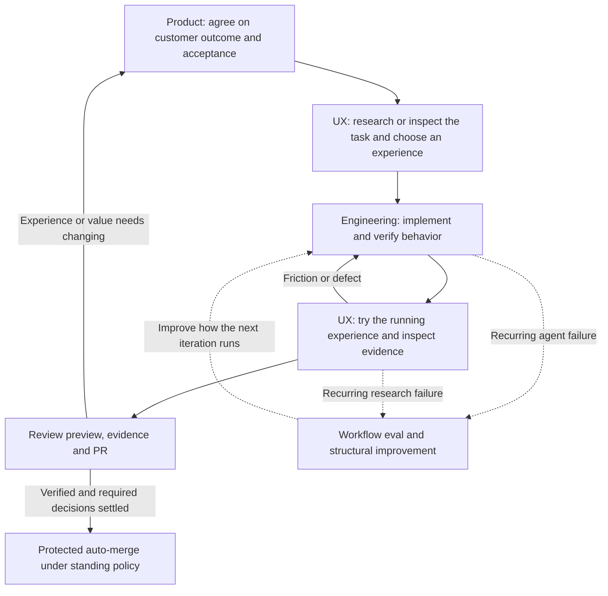

# How the loops work together

The product loop sets the destination. The UX loop studies and improves the path a customer takes. The engineering loop makes the agreed behavior work. Workflow evals improve how the agent performs that work.

These are feedback loops, not four required ceremonies for every change. A settled bug may need only the engineering loop. A substantial feature needs product alignment and an experience review. A competitor study runs the UX loop and returns findings before product implementation. Research can reveal an unresolved customer choice and send it back to product alignment.

The agent's inner loop can run many times while you are away. Each iteration needs new evidence from a test, application interaction or observed state. The outer product/experience checkpoint is where you or customers try the result and decide whether it solves the intended problem.

For example, to let a user save an item and find it later:

1. Product alignment establishes the customer, context and useful outcome.
2. UX research examines organization, feedback and recovery in approved apps, then proposes a flow for our customer.
3. Engineering implements it and checks save, reload and independent readback.
4. UX review checks navigation, feedback, loading/errors, focus, motion and relevant devices in the running application.
5. The owner receives a walkthrough and PR, tries the task and accepts it or gives specific feedback. Protected auto-merge can land technically verified work before this feedback; required product decisions must be settled before it is queued.

Workflow evals are separate experiments on the agent's methods. Passing an app test does not prove a skill makes good decisions. A skill eval does not prove an app works. Inspect actual tool use and artifacts; compare variants on equivalent isolated tasks where practical. Prefer a deterministic test, type or CI check for repeated mechanical errors.

Keep owner decisions, agent assumptions, implementation, verification and acceptance distinct in existing canonical records. A screenshot cannot prove persistence; a component fixture cannot prove an authenticated app path; an agent's UX critique cannot establish customer usability. The [verification contract](verification.md) defines evidence scopes.

## Relationship to Lauren Tan's published workflow

The [published workshop outline](https://maven.com/p/e23d9c/how-cursor-turned-ai-agents-into-better-engineers) covers verification skills and feature maps, skill maintenance through evals, moving verification into cloud agents, and CI constraints. This comparison uses that outline and the pinned original pstack source; it is not a claim to have audited every statement in the video transcript.

| Published mechanism | jfactory implementation | Evidence boundary |
| --- | --- | --- |
| Drive the real app and observe behavior | Original [verification generator](../vendor/pstack/skills/create-verification-skill/SKILL.md), repository-local verifier and scoped evidence | Each repository must demonstrate its own journey and side effects; a generated file is not proof |
| Keep the feature map and verification instructions current | Original [verification maintenance skill](../vendor/pstack/skills/maintain-verification-skill/SKILL.md), plus updates during affected work | Only exercised journeys gain current runtime evidence |
| Evaluate the agent's skills separately from the app | Original [eval playbook](../vendor/pstack/skills/poteto-mode/playbooks/eval.md), with isolated tasks, blinded judging and inspection of actual actions/artifacts | Evaluation scenarios are specified; full adoption and cross-model trials have not yet been demonstrated |
| Run many agents on one program through task contracts, a durable record and continuous landing | Original [orchestrate](../vendor/pstack/skills/poteto-mode/playbooks/orchestrate.md) and [multi-PR plan](../vendor/pstack/skills/poteto-mode/playbooks/multi-phase-plan.md), adapted in the [coordination procedure](coordination.md) | Specified for Conductor and GitHub; no end-to-end multi-workspace trial yet |
| Increase autonomy with observed evidence and enforceable checks | Bounded objectives, observed checks, protected PR delivery and explicit environment readiness | CI enforces selected tests; it cannot establish customer value or cover untested behavior |

There are two different outer feedback paths. Product/UX feedback asks whether we chose a useful outcome and experience. Workflow evals ask whether the agent followed an effective method and produced correct artifacts. Neither can be substituted for the engineering loop that runs and checks the application.

jfactory adds the product interview, competitor UX research, documentation reconciliation, host setup and update procedures. It adapts pstack's prototype, planning and orchestration playbooks to Conductor workspaces and GitHub in the [coordination procedure](coordination.md). It does not import sticky Poteto Mode, the orchestration CLI or Cursor's internal tools. Adding instructions is not equivalent to validating them across models. The next confidence-building step is an observed repository adoption and a bounded task, followed by realistic skill evals for material workflow changes. Keep those results separate from packaging and browser-helper tests.
