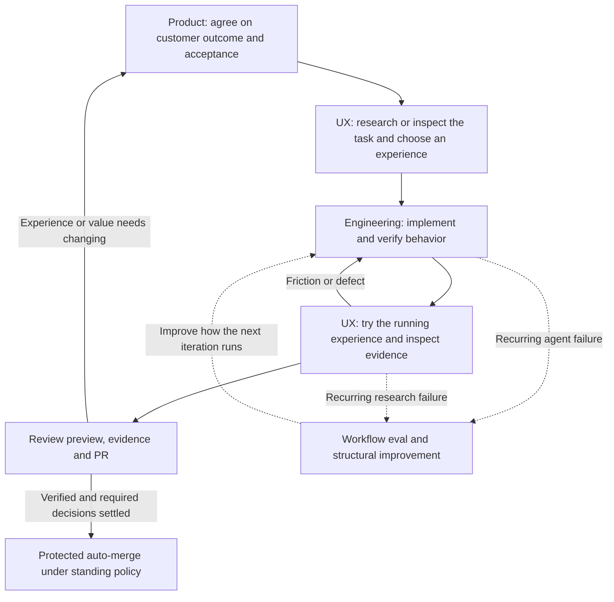

# How the loops work together

The product loop sets the destination. The UX loop studies and improves the path a customer takes. The engineering loop makes the agreed behavior work. Workflow evals improve how the agent performs that work.

These are feedback loops, not four required ceremonies for every change. A settled bug may need only the engineering loop. A substantial feature needs product alignment and an experience review. A competitor study runs the UX loop and returns findings before product implementation. Research can reveal an unresolved customer choice and send it back to product alignment.

The agent's inner loop can run many times while you are away. Each iteration needs new evidence from a test, application interaction or observed state. The outer product/experience checkpoint is where you or customers try the result and decide whether it solves the intended problem.

For example, to let a user save an item and find it later:

1. Product alignment establishes the customer, context and useful outcome.
2. UX research examines organization, feedback and recovery in approved apps, then proposes a flow for our customer.
3. Engineering implements it and checks save, reload and independent readback.
4. UX review checks navigation, feedback, loading/errors, focus, motion and relevant devices in the running application.
5. The owner receives a walkthrough and PR, tries the task and accepts it or gives specific feedback. Protected auto-merge can land technically verified work before this feedback; required product decisions must be settled before it is queued.

Workflow evals are separate experiments on the agent's methods. Passing an app test does not prove a skill makes good decisions. A skill eval does not prove an app works. Inspect actual tool use and artifacts; compare variants on equivalent isolated tasks where practical. Prefer a deterministic test, type or CI check for repeated mechanical errors.

Keep owner decisions, agent assumptions, implementation, verification and acceptance distinct in existing canonical records. A screenshot cannot prove persistence; a component fixture cannot prove an authenticated app path; an agent's UX critique cannot establish customer usability. The [verification contract](verification.md) defines evidence scopes.
