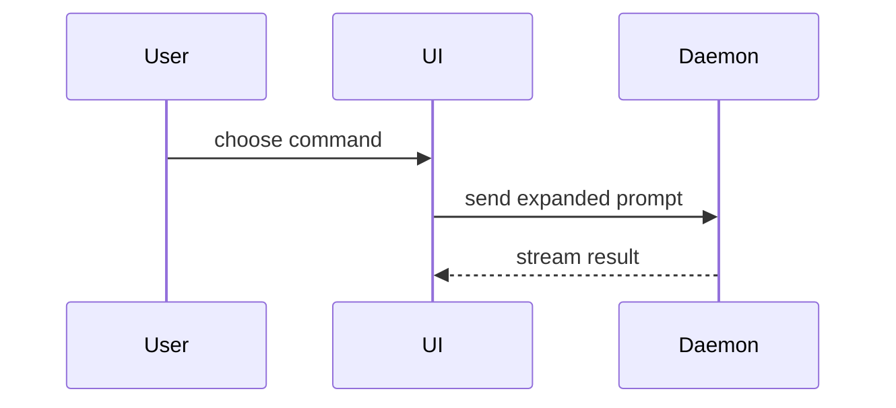

# jfactory integration

Read this entire skill with the host's full-file reader before explaining the change or asking for decisions. If the output is truncated, continue through the remaining sections. This integration governs both unchanged pinned methods below.

The method below is HumanLayer's unchanged [show-me body](../../vendor/humanlayer/skills/show-me/SKILL.md), included here so loading this skill loads the actual method. The original is manual-only; this adapter enables proactive use for changes, PR explanations, feedback and choices.

Read the current objective and relevant job goals and standards before suggesting alternatives. If an open choice would establish or revise a goal, apply the complete grilling method included below before asking about it; carry confirmed answers forward. Choose the smallest useful view: a before/after diff, file or call tree, diagram, or focused HTML comparison. Ground it in the actual change and canonical goals; label proposed behavior and unknowns. Put it beside the decision or feedback it supports, with brief text explaining the consequence. For a PR, include a useful view in its description or linked review artifact when the change needs one. Use a short textual comparison when no visual adds clarity; do not manufacture UI screenshots for CLI or instruction changes.

Use host-supported rendering and sharing. For HTML in a cloud workspace, use a supported preview or linked artifact instead of blindly running macOS `open`. Follow the repository's artifact conventions and keep private data out of shared artifacts. A sketch explains a proposal; it is not observed application evidence, independent verification or owner acceptance. When the owner settles a choice that changes standing intent, first update both the current objective and each affected `outcomes/<job>.md` goal with its proof requirement, plus the affected product, engineering or UI/UX sources named in `.jfactory/standards.md`. Link the owner decision, label assumptions and retain unproven status until the required evidence exists. Do this before dependent implementation or calling the feedback resolved; recording the choice only in the objective or setup record leaves verifier intent stale. An unchanged decision needs no documentation churn. Use [documentation reconciliation](../../references/documentation.md) to preserve one authority per fact.

# Grilling when feedback establishes or revises goals

Apply this section only when the discussion establishes or revises a goal or leaves consequential intent unresolved. It contains the same full method and jfactory integration as the standalone [grilling skill](../grilling/SKILL.md), so reading show-me loads both methods for this branch. A settled explanation needs no interview.

# Matt Pocock's grilling method

Interview the user relentlessly until you reach a shared understanding. Map this as a **design tree**: every decision branches into the decisions that hang off it.

Work the tree in **rounds**. The **frontier** is every decision whose prerequisites are already settled: the questions you can ask _now_ without guessing at answers you haven't heard yet. Ask the whole frontier in one round: number each question and give your recommended answer. Then wait for the user's answers before the next round.

Format a round like so:

```
❓ **Q1** - **<question title>**: <question body, might be multiple paragraphs, including multiple choices>

➡️ <your recommended answer>

---

❓ **Q2** - **<question title>**: <question body, might be multiple paragraphs, including multiple choices>

➡️ <your recommended answer>
```

Each round the user answers reshapes the tree: settled decisions push the frontier outward and unblock questions that depended on them. Recompute the frontier and ask the next round. A question whose answer depends on another question still open in this round belongs to a _later_ round, not this one.

Finding _facts_ is your job, never the user's. When a frontier question needs a fact from the environment (filesystem, tools, etc.), dispatch a sub-agent to find it; don't ask the user for anything you could look up yourself. Don't block on it: a running exploration is an unsettled prerequisite, so only the questions downstream of it wait for the sub-agent to report; ask the rest of the frontier now. The _decisions_ are the user's: put each to them and wait.

The session is done when the frontier is empty: every branch of the design tree visited, nothing left silently assumed. Do not act on it until the user confirms you have reached a shared understanding.

# jfactory integration

The method above is Matt Pocock's unchanged [grilling body](../../vendor/mattpocock/skills/grilling/SKILL.md), included here so loading this skill loads the actual method. Apply these jfactory translations to it.

Start from the owner's request and canonical records. During first setup, cover the required [owner interview](../../references/setup.md#2-reconcile-the-foundation). On updates and resumed objectives, carry confirmed answers forward. For each objective, establish the customer outcome, scope, non-goals, affected job goals, observable acceptance criteria and their evidence. If these are already settled, record that and proceed; another confirmation is unnecessary. Ask each consequential unresolved decision with a recommendation; dependent implementation waits for the answer. Existing explicit authorization counts as confirmation within its scope.

Find technical facts from the repository and tools. Upstream's subagent instruction maps to the host's authorized delegation; inspect directly when delegation is unavailable or unnecessary. Use the host's supported question UI and formatting. Continue independent work while answers or investigations are pending.

Write answers and unresolved choices into the existing objective and setup record. When a decision changes standing intent, update the affected project-owned outcome/job documents, engineering sources, UI/UX sources and standards map in the same PR, linking the decision. Keep assumptions marked as assumptions and evidence tied to its revision. Do not change goals merely to make failing behavior pass. Use [documentation reconciliation](../../references/documentation.md) to retain one authority per fact; the verifier reads those records, not a separate interview transcript.

# HumanLayer's show-me method

Help the user understand the current topic of conversation visually. Skip the preamble and keep prose brief. Pick the smallest view that makes the key point clear.

- Show logic or an algorithm as pseudocode:

```text
on(save)
  if content is unchanged
    return cached result
  write new content
  return fresh result
```

- Show runtime control flow as a call tree:

```text
submitForm
  createSession
    persistPrompt
    launchAgent
  navigateToSession
```

- Show UI structure as a component tree, including state and module boundaries that matter:

```tsx
<SessionPage> (apps/example/src/routes/session.tsx)
  useSessionEvents()
  <SessionToolbar>
    <RunSkillButton> (packages/ui)
```

- Show file responsibility or a broad refactor as a shallow file tree:

```text
src/
├── commands/       # parses user actions
├── sessions/       # owns session state
└── transport/      # sends API requests
```

- Show component interaction, control flow, or data flow with Mermaid:



- Use `diff` when the point is what changes and the surrounding shape already exists. Match the diff shape to the topic.

For a component change:

```diff
 <SessionPage>
   useSessionEvents()
   <SessionToolbar>
+    <RunSkillButton />
   <SessionTimeline>
+    <SkillResultCard />
```

For a file-layout change:

```diff
 src/
 ├── commands/
+│   └── show-me.ts       # expands the slash command
 ├── sessions/
-└── transport.ts
+└── transport/
+    ├── client.ts
+    └── stream.ts
```

For a call-tree or call-stack change:

```diff
 submitForm
   createSession
     persistPrompt
+    expandSkillMention
     launchAgent
-  navigateToSession
+  navigateToSession
+    subscribeToEvents
```

For a state or control-flow change:

```diff
 on(save)
-  write content
+  if content is unchanged
+    return cached result
+  write new content
+  invalidate cache
```

- Show the whole block when most of it is new, when omitted context would hide ownership or order, or when the user needs a copyable target shape:

```ts
function expandSkill(command: string): string {
  const skillName = command.slice(1)
  return `use the ${skillName} skill`
}
```

- For a visual UI, layout, state comparison, or concept too dense for Mermaid, write one focused HTML file — a diagram, an infographic, or a short slide deck, whichever fits the point. Match the product's colors, type, spacing, and components; use real labels and data; support desktop and mobile. Then open it for the user:

```
Bash(open path/to/show-me-{description}.html)
```

### guidance

Place each visual next to the short text it supports. Keep only the calls, files, props, states, and boundaries needed to answer the user's current question or the options to resolve the current discussion point.

You may use one of these, you may use several, it is unlikely you will use all of them. Use your judgement and don't overwhelm the user.
