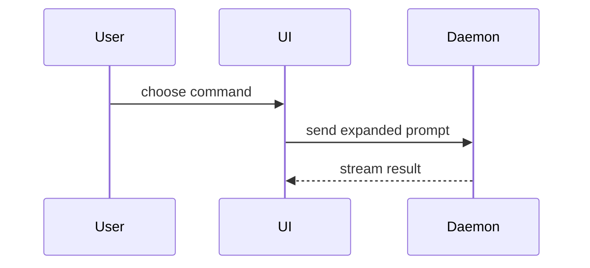

# HumanLayer's show-me method

Help the user understand the current topic of conversation visually. Skip the preamble and keep prose brief. Pick the smallest view that makes the key point clear.

- Show logic or an algorithm as pseudocode:

```text
on(save)
  if content is unchanged
    return cached result
  write new content
  return fresh result
```

- Show runtime control flow as a call tree:

```text
submitForm
  createSession
    persistPrompt
    launchAgent
  navigateToSession
```

- Show UI structure as a component tree, including state and module boundaries that matter:

```tsx
<SessionPage> (apps/example/src/routes/session.tsx)
  useSessionEvents()
  <SessionToolbar>
    <RunSkillButton> (packages/ui)
```

- Show file responsibility or a broad refactor as a shallow file tree:

```text
src/
├── commands/       # parses user actions
├── sessions/       # owns session state
└── transport/      # sends API requests
```

- Show component interaction, control flow, or data flow with Mermaid:



- Use `diff` when the point is what changes and the surrounding shape already exists. Match the diff shape to the topic.

For a component change:

```diff
 <SessionPage>
   useSessionEvents()
   <SessionToolbar>
+    <RunSkillButton />
   <SessionTimeline>
+    <SkillResultCard />
```

For a file-layout change:

```diff
 src/
 ├── commands/
+│   └── show-me.ts       # expands the slash command
 ├── sessions/
-└── transport.ts
+└── transport/
+    ├── client.ts
+    └── stream.ts
```

For a call-tree or call-stack change:

```diff
 submitForm
   createSession
     persistPrompt
+    expandSkillMention
     launchAgent
-  navigateToSession
+  navigateToSession
+    subscribeToEvents
```

For a state or control-flow change:

```diff
 on(save)
-  write content
+  if content is unchanged
+    return cached result
+  write new content
+  invalidate cache
```

- Show the whole block when most of it is new, when omitted context would hide ownership or order, or when the user needs a copyable target shape:

```ts
function expandSkill(command: string): string {
  const skillName = command.slice(1)
  return `use the ${skillName} skill`
}
```

- For a visual UI, layout, state comparison, or concept too dense for Mermaid, write one focused HTML file — a diagram, an infographic, or a short slide deck, whichever fits the point. Match the product's colors, type, spacing, and components; use real labels and data; support desktop and mobile. Then open it for the user:

```
Bash(open path/to/show-me-{description}.html)
```

### guidance

Place each visual next to the short text it supports. Keep only the calls, files, props, states, and boundaries needed to answer the user's current question or the options to resolve the current discussion point.

You may use one of these, you may use several, it is unlikely you will use all of them. Use your judgement and don't overwhelm the user.

# jfactory integration

The method above is HumanLayer's unchanged [show-me body](../../vendor/humanlayer/skills/show-me/SKILL.md), included here so loading this skill loads the actual method. The original is manual-only; this adapter enables proactive use for changes, PR explanations, feedback and choices.

Read the current objective and relevant job goals and standards before suggesting alternatives. If an open choice would establish or revise a goal, read the complete [grilling skill](../grilling/SKILL.md) before asking about it; carry confirmed answers forward. Choose the smallest useful view: a before/after diff, file or call tree, diagram, or focused HTML comparison. Ground it in the actual change and canonical goals; label proposed behavior and unknowns. Put it beside the decision or feedback it supports, with brief text explaining the consequence. For a PR, include a useful view in its description or linked review artifact when the change needs one. Use a short textual comparison when no visual adds clarity; do not manufacture UI screenshots for CLI or instruction changes.

Use host-supported rendering and sharing. For HTML in a cloud workspace, use a supported preview or linked artifact instead of blindly running macOS `open`. Follow the repository's artifact conventions and keep private data out of shared artifacts. A sketch explains a proposal; it is not observed application evidence, independent verification or owner acceptance. Record resulting decisions through [documentation reconciliation](../../references/documentation.md) and use [grilling](../grilling/SKILL.md) when feedback exposes unresolved goals.
